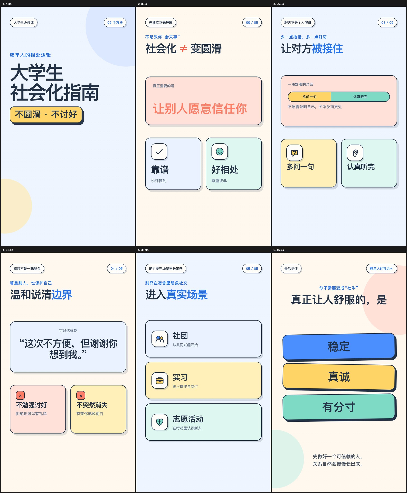

# 大学生竖屏教程视频风格 Skill

一套可复用的 Codex 视频制作规范，用来生成面向大学生的中文竖屏教程视频，尤其适合社会化、校园成长、第一次独立生活和实用经验类选题。

它记录了已经确认过的成片风格：自然连贯的中文口播、云希男声、醒目的大标题封面、奶油白与浅蓝贴纸卡片，以及轻柔、不生硬的动画节奏。



## 这个 Skill 解决什么

- **口播更自然**：先按语义组织句子，再用长短不同的停顿连接观点，避免逐句机械朗读。
- **声音保持一致**：默认使用已确认的 Yunxi 神经网络男声，不静默替换成系统音色。
- **封面一眼看懂**：封面只保留一个视觉中心，用足够大的主题标题建立信息层级。
- **画面轻松友好**：使用奶油白、浅蓝、厚线条图标和贴纸卡片，适合校园与成长类内容。
- **动画不生硬**：以淡入、小幅位移和顺着语义展开为主，减少硬推、弹跳和重复入场。
- **制作可验证**：要求检查封面、配音来源、场景时长、卡片布局和关键帧，再输出成片。

## 适用场景

- 大学生社会化与人际沟通
- 宿舍、社团、课堂和实习相处指南
- 第一次独立生活、办事与避坑教程
- 校园成长、情绪管理和实用经验分享
- 延续同一账号视觉与声音风格的系列短视频

## 安装

把仓库克隆到 Codex 的 skills 目录：

```bash
git clone https://github.com/zhaohe0307-lgtm/college-social-video-style.git \
  ~/.codex/skills/college-social-video-style
```

重新打开 Codex 会话后即可使用。

## 使用示例

```text
使用 $college-social-video-style，做一个教大学生第一次参加社团聚餐时怎么自然融入的竖屏视频。
```

```text
使用 $college-social-video-style 修改这个视频：语句之间的间隔更自然，封面加一个醒目的大标题，动画柔和一点。
```

```text
沿用大学生社会化视频风格，做下一期“第一次实习怎么和同事相处”。
```

## 已固化的风格规则

1. 先完成口播稿，再根据处理后的音频划分场景。
2. 句间停顿服从语义：同一观点短停，转折中停，章节切换长停。
3. 封面采用单一视觉中心，主标题必须是第一注意力。
4. 视觉元素随口播含义逐步出现，不在场景开头一次性全部展示。
5. 动画优先使用轻柔淡入和小幅移动，避免连续硬切与弹跳。
6. 每次修改后执行 HyperFrames 检查，并抽取封面及各场景稳定帧做视觉核对。
7. 修改成片时使用版本化文件名，不覆盖已经交付的视频。

完整参数和执行细节见 [style-spec.md](references/style-spec.md)。

## 目录结构

```text
college-social-video-style/
├── SKILL.md
├── agents/
│   └── openai.yaml
├── assets/
│   ├── approved-frame.md
│   ├── approved-reference-contact-sheet.jpg
│   └── approved-template.html
└── references/
    └── style-spec.md
```

## 说明

这是一套面向 Codex 与 HyperFrames 工作流的个人视频风格 Skill。当前指令优先于默认规范；当选题需要完全不同的声音或视觉方向时，可以在提示词中明确覆盖。
